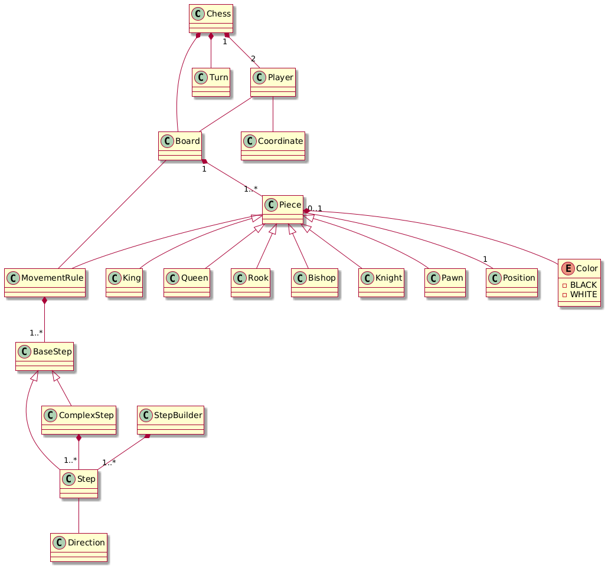

# Curso: Programación Orientada a Objetos — Máster de Desarrollo de Software.
## Chess: Implementación del diagrama de dominio

### Modelo del dominio



### Descripción general

Junto con Board, Coordinate, Direction, define la jerarquía de las diferentes piezas del ajedrez y usa la clase MovementRule junto con Step y ComplexStep para definir el movimiento de cada pieza, esto se construye usando la clase StepBuilder. Por otra parte la clase Turn permite gestionar los turnos de movimiento de cada jugador.


### Interfaz del juego

**Ingreso de combinación propuesta e intentos**

```
# | R | H | B | Q | K | B | H | R |
# | P | P | P | P | P | P | P | P |
# |   |   |   |   |   |   |   |   |
# |   |   |   |   |   |   |   |   |
# |   |   |   |   |   |   |   |   |
# |   |   |   |   |   |   |   |   |
# | p | p | p | p | p | p | p | p |
# | r | h | b | q | k | b | h | r |
# WHITE's playing...
# Pick up a piece...
#
# Type row [0..7]: 2
# Type colum [0..7]: 5
#
# Type row [0..7]: 3
# Type colum [0..7]: 5

```