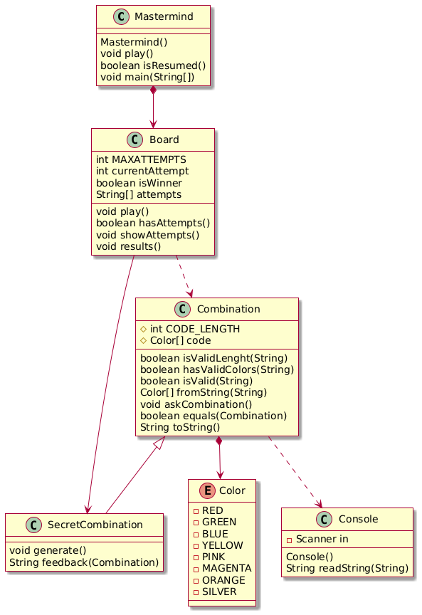

# Curso: Programación Orientada a Objetos — Máster de Desarrollo de Software.
## Mastermind: Implementación del diagrama de dominio

### Diagrama de clases



### Descripción general

Conforme al diagrama de dominio básico, se implementan las clases Board, Combination, SecretCombination, Console y Mastermind, adicionalmente se el enumerado Color.

La clase Mastermind define el metodo main como entrada de ejecución del juego. Utiliza la clase Board para jugar y Console para mostrar información en pantalla.

### Clases

* Mastermind: Entrada principal al juego e interacción con el usuario.
* Board: Implementa el tablero y controla la entrada de combinaciones para comparar y decidir si se gana o pierde el juego.
* Combination: Define la lista de colores que constituyen una combinación.
* SecretCombination: Clase hija de Combination la cual permite generar una combinación aleatorea.
* Console: Permite imprimir mensajes en pantalla.
* enum Color: Define los posibles colores que puede tomar una combinación.

### Interfaz del juego

**Ingreso de combinación propuesta e intentos**

```
# ----- MASTERMIND -----
# 1 attempt(s)
# Propose a combination: rgpm
.
.
.
```

**Ganador del juego**

```
# You have Won!!!
```

**Reiniciar juego o salir**

```
# Resume? (y/n): y
```